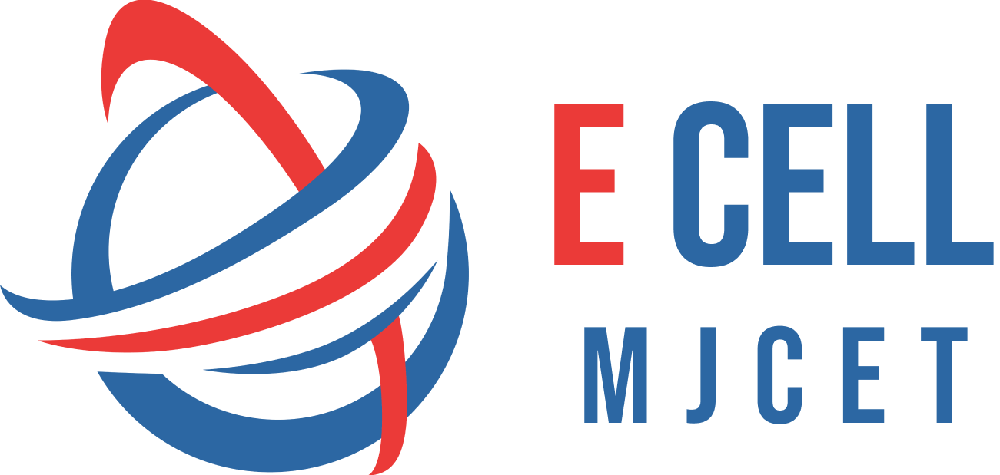

[![Contributors][contributors-shield]][contributors-url]
[![Forks][forks-shield]][forks-url]
[![Stargazers][stars-shield]][stars-url]
[![Issues][issues-shield]][issues-url]
[![MIT License][license-shield]][license-url]
[![LinkedIn][linkedin-shield]][linkedin-url]

<br />
<div align="center">
  <a href="https://github.com/othneildrew/Best-README-Template">
    
  </a>

  <h3 align="center">E-Cell MJCET</h3>

  <p align="center">
	  Official website of E-Cell MJCET, fostering innovation and entrepreneurship through events, resources, and mentorship for aspiring entrepreneurs.
    <br />
    <br />
    <a href="#getting-started"><strong>Explore the docs »</strong></a>
    <br />
    <br />
    <a href="https://ecellmjcet.com">View Website</a>
    ·
    <a href="https://github.com/E-Cell-MJCET/Website/issues">Report Bug</a>
    ·
    <a href="https://github.com/E-Cell-MJCET/Website/issues">Request Feature</a>
  </p>
</div>

<br />
<br />

<details>
  <summary>Table of Contents</summary>
  <ol>
    <li>
      <a href="#about-the-project">About The Project</a>
      <ul>
        <li><a href="#built-with">Built With</a></li>
      </ul>
    </li>
    <li>
      <a href="#getting-started">Getting Started</a>
      <ul>
        <li><a href="#prerequisites">Prerequisites</a></li>
        <li><a href="#installation">Installation</a></li>
      </ul>
    </li>
    <li><a href="#roadmap">Roadmap</a></li>
    <li><a href="#contributing-guidelines">Contributing</a></li>
    <li><a href="#top-contributers">Top Contributers<a/></li>
    <li><a href="#license">License</a></li>
    <li><a href="#acknowledgments">Acknowledgments</a></li>
  </ol>
</details>


## About The Project


Welcome to the official repository for ecellmjcet.com, the website of the Entrepreneurship Cell (E-Cell) at Muffakham Jah College of Engineering and Technology (MJCET). This platform serves as a hub for aspiring entrepreneurs, showcasing our initiatives, events, and resources aimed at fostering innovation, startup culture, and entrepreneurial growth among students.


### Built With


<div>
  <p>
    
    
    
    
    
    
    
    
    
  </p>
</div>
	
	


## Getting Started
### Prerequisites


* bun (MacOS or Linux)
  ```sh
  npm install bun -g
  ```

* bun (Windows)
  ```sh
  powershell -c "irm bun.sh/install.ps1 | iex"
  ```

### Installation


1. Get the API Key from the CTO
2. Clone the repo
   ```sh
   git clone https://github.com/E-Cell-MJCET/Website.git
   ```
3. Install  packages
   ```sh
   bun install
   ```
4. Enter your credentials in `.env`
   ```sh
   
    NEXT_PUBLIC_SUPABASE_URL="SUPABASE_URL"
    NEXT_PUBLIC_SUPABASE_ANON_KEY="SECRET_ANNON_KEY"
            
   ```
5. Change git remote url to avoid accidental pushes to base project
   ```sh
   git remote set-url origin https://github.com/E-Cell-MJCET/Website.git
   git remote -v # confirm the changes
   ```

<p align="right">(<a href="#readme-top">back to top</a>)</p>

### Contributing Guidelines

## 1. Branching Strategy
Start from dev branch: When starting any work, always create your branch from the dev branch.
Branch naming convention:
For new features: feat/featurename
For bug fixes: fix/whatyouarefixing
For documentation updates: docs/whatyouupdated
For refactoring code: refactor/whatyourefactored
For urgent hotfixes: hotfix/urgentfix

## 2. Pull Request (PR) Workflow
### Step 1: Development
After completing your task, push your changes and create a PR to merge your branch into the dev branch.
Provide a clear description of the changes in the PR.
### Step 2: Testing
Once all changes are merged into the dev branch by all contributors, a PR should be created from dev to the test branch.
Ensure the code is properly tested.
At least 2 members must review and approve the PR before merging into the test branch.
### Step 3: Production
After successful testing, create a PR from the test branch to the main branch.
This PR must be approved by the CTO and at least 1 other member.
Once approved, the changes will be deployed to production.
## 3. Commit Message Guidelines
Use the following prefixes for clear and consistent commit messages:

```
feat: for new features.
fix: for bug fixes.
docs: for documentation updates.
refactor: for code refactoring.
style: for formatting and style changes (not affecting code logic).
test: for adding or updating tests.
chore: for maintenance tasks.
```
```
Example: feat: add user authentication to login page.
```
## 4. CI/CD Pipeline Requirements
The CI/CD pipeline must run error-free.
Both ESLint checks and Next.js build must pass successfully for the PR to be valid.
## 5. Conflict Resolution
If any merge conflicts arise, contributors should immediately contact the CTO for resolution.
## 6. PR Review Time
All PRs should be reviewed and resolved within 5 days of submission.
## 7. Emergency Procedure
In case of critical hotfixes or urgent issues, the CTO must trigger the emergency procedure.
The PR can then be approved by the CTO alone, bypassing the usual workflow.


# Top Contributers
<a href="https://github.com/E-Cell-MJCET/Website/graphs/contributors">
  
</a>


<!--Markdown Links-->

[contributors-shield]: https://img.shields.io/github/contributors/E-Cell-MJCET/Website.svg?style=for-the-badge
[contributors-url]: https://github.com/E-Cell-MJCET/Website/graphs/contributors
[forks-shield]: https://img.shields.io/github/forks/E-Cell-MJCET/Website.svg?style=for-the-badge
[forks-url]: https://github.com/E-Cell-MJCET/Website/network/members
[stars-shield]: https://img.shields.io/github/stars/E-Cell-MJCET/Website.svg?style=for-the-badge
[stars-url]: https://github.com/E-Cell-MJCET/Website/stargazers
[issues-shield]: https://img.shields.io/github/issues/E-Cell-MJCET/Website.svg?style=for-the-badge
[issues-url]: https://github.com/E-Cell-MJCET/Website/issues
[license-shield]: https://img.shields.io/github/license/E-Cell-MJCET/Website.svg?style=for-the-badge
[license-url]: https://github.com/E-Cell-MJCET/Website/blob/master/LICENSE.txt
[linkedin-shield]: https://img.shields.io/badge/-LinkedIn-black.svg?style=for-the-badge&logo=linkedin&colorB=555
[linkedin-url]: https://www.linkedin.com/company/e-cell-mjcet/
